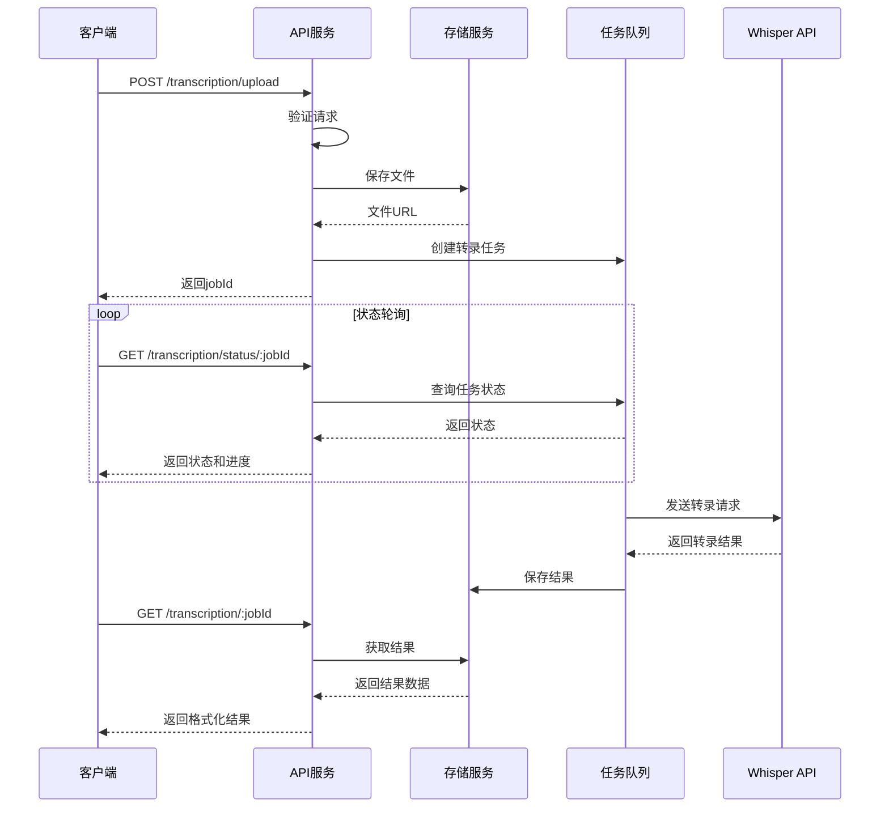
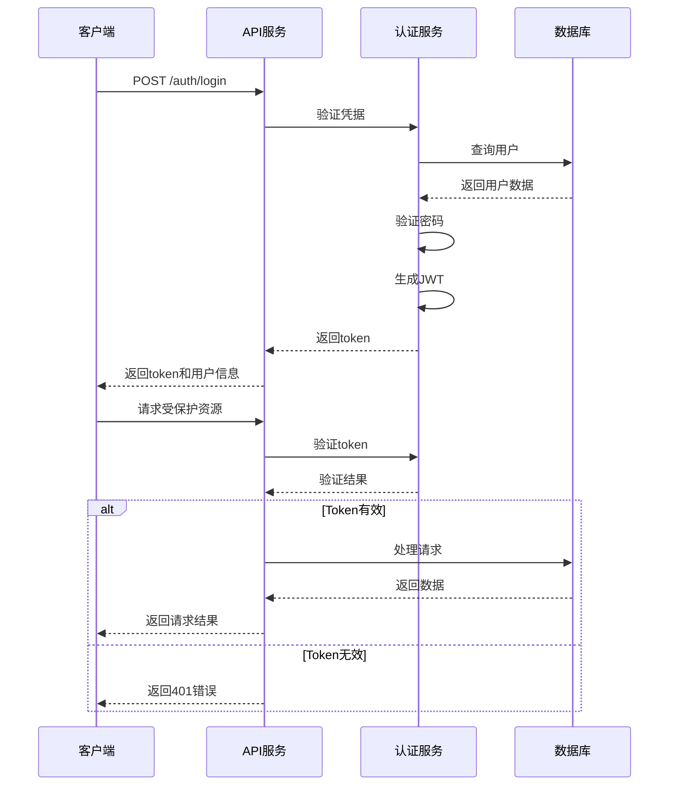

# AudioScript API 文档

## API 基础信息

- 基础URL: `http://localhost:3000/api` (开发环境)
- 生产URL: `https://api.audioscript.example.com/api` (生产环境)
- 响应格式: JSON
- 认证方式: Bearer Token (可选)
- API 版本: v1
- 内容类型: `application/json`, `multipart/form-data` (文件上传)

## 1. 认证接口

### 1.1 用户注册

```http
POST /auth/register
Content-Type: application/json
```

**请求参数:**
| 参数名 | 类型 | 必填 | 描述 |
|--------|------|------|------|
| email | string | 是 | 用户邮箱 |
| password | string | 是 | 用户密码 (至少8位) |
| name | string | 否 | 用户名称 |

**请求示例:**
```json
{
  "email": "user@example.com",
  "password": "securePassword123",
  "name": "John Doe"
}
```

**响应示例:**
```json
{
  "success": true,
  "data": {
    "userId": "user_123456",
    "email": "user@example.com",
    "name": "John Doe",
    "createdAt": "2024-03-20T12:00:00Z"
  }
}
```

### 1.2 用户登录

```http
POST /auth/login
Content-Type: application/json
```

**请求参数:**
| 参数名 | 类型 | 必填 | 描述 |
|--------|------|------|------|
| email | string | 是 | 用户邮箱 |
| password | string | 是 | 用户密码 |

**请求示例:**
```json
{
  "email": "user@example.com",
  "password": "securePassword123"
}
```

**响应示例:**
```json
{
  "success": true,
  "data": {
    "token": "eyJhbGciOiJIUzI1NiIsInR5cCI6IkpXVCJ9...",
    "expiresIn": 86400,
    "user": {
      "userId": "user_123456",
      "email": "user@example.com",
      "name": "John Doe"
    }
  }
}
```

### 1.3 获取当前用户信息

```http
GET /auth/me
Authorization: Bearer {token}
```

**响应示例:**
```json
{
  "success": true,
  "data": {
    "userId": "user_123456",
    "email": "user@example.com",
    "name": "John Doe",
    "createdAt": "2024-03-20T12:00:00Z",
    "plan": "free"
  }
}
```

## 2. 文件上传接口

### 2.1 上传音频/视频文件

```http
POST /transcription/upload
Content-Type: multipart/form-data
Authorization: Bearer {token} (可选)
```

**请求参数:**
| 参数名 | 类型 | 必填 | 描述 |
|--------|------|------|------|
| file | File | 是 | 音频/视频文件 |
| language | string | 否 | 音频语言（默认自动检测） |
| model | string | 否 | 转录模型选择 (默认: "whisper-1") |
| segments | boolean | 否 | 是否返回分段信息 (默认: true) |
| timestamps | boolean | 否 | 是否包含时间戳 (默认: true) |
| auto_punctuation | boolean | 否 | 是否启用智能标点 (默认: true) |
| punctuation_style | string | 否 | 标点风格 (默认: "standard", 可选: "minimal", "detailed") |
| detect_language | boolean | 否 | 是否自动检测语言 (默认: true) |
| multi_language | boolean | 否 | 是否支持混合多语言识别 (默认: true) |
| tone_analysis | boolean | 否 | 是否进行语气分析 (默认: true) |

**响应示例:**
```json
{
  "success": true,
  "data": {
    "jobId": "job_123456",
    "status": "waiting",
    "filename": "audio.mp3",
    "fileSize": 2048576,
    "fileType": "audio/mpeg",
    "createdAt": "2024-03-20T12:00:00Z",
    "estimatedProcessingTime": "00:02:30"
  }
}
```

### 2.2 获取转录状态

```http
GET /transcription/status/:jobId
Authorization: Bearer {token} (可选)
```

**路径参数:**
| 参数名 | 类型 | 描述 |
|--------|------|------|
| jobId | string | 转录作业ID |

**响应示例:**
```json
{
  "success": true,
  "data": {
    "jobId": "job_123456",
    "status": "processing",
    "progress": 45,
    "estimatedTimeRemaining": "00:01:30",
    "createdAt": "2024-03-20T12:00:00Z",
    "updatedAt": "2024-03-20T12:01:15Z"
  }
}
```

### 2.3 获取转录结果

```http
GET /transcription/:jobId
Authorization: Bearer {token} (可选)
```

**路径参数:**
| 参数名 | 类型 | 描述 |
|--------|------|------|
| jobId | string | 转录作业ID |

**查询参数:**
| 参数名 | 类型 | 描述 |
|--------|------|------|
| format | string | 结果格式 (json, text, srt, vtt) |

**响应示例:**
```json
{
  "success": true,
  "data": {
    "jobId": "job_123456",
    "status": "completed",
    "result": {
      "text": "这是完整的转录文本内容。这是一个示例转录结果，展示了音频内容的文字版本。",
      "segments": [
        {
          "id": 0,
          "start": 0.0,
          "end": 3.5,
          "text": "这是完整的转录文本内容。",
          "confidence": 0.98,
          "tone": "neutral",
          "language": "zh"
        },
        {
          "id": 1,
          "start": 3.5,
          "end": 7.2,
          "text": "这是一个示例转录结果，展示了音频内容的文字版本。",
          "confidence": 0.95,
          "tone": "informative",
          "language": "zh"
        }
      ],
      "language": "zh",
      "detectedLanguages": ["zh"],
      "duration": 7.2,
      "wordCount": 24,
      "processingTime": 3.5,
      "toneAnalysis": {
        "overall": "neutral",
        "segments": [
          {
            "start": 0.0,
            "end": 3.5,
            "tone": "neutral"
          },
          {
            "start": 3.5,
            "end": 7.2,
            "tone": "informative"
          }
        ]
      },
      "punctuationInfo": {
        "style": "standard",
        "count": {
          "period": 2,
          "comma": 1,
          "question": 0,
          "exclamation": 0
        }
      }
    },
    "originalFilename": "audio.mp3",
    "createdAt": "2024-03-20T12:00:00Z",
    "completedAt": "2024-03-20T12:02:30Z"
  }
}
```

### 2.4 删除转录作业

```http
DELETE /transcription/:jobId
Authorization: Bearer {token} (可选)
```

**路径参数:**
| 参数名 | 类型 | 描述 |
|--------|------|------|
| jobId | string | 转录作业ID |

**响应示例:**
```json
{
  "success": true,
  "data": {
    "message": "转录作业已成功删除",
    "jobId": "job_123456",
    "deletedAt": "2024-03-20T14:30:00Z"
  }
}
```

## 3. 转录历史接口

### 3.1 获取转录历史列表

```http
GET /transcription/history
Authorization: Bearer {token}
```

**查询参数:**
| 参数名 | 类型 | 描述 |
|--------|------|------|
| page | number | 页码 (默认: 1) |
| limit | number | 每页数量 (默认: 10, 最大: 50) |
| status | string | 筛选状态 (waiting, processing, completed, failed) |
| sortBy | string | 排序字段 (createdAt, completedAt, fileSize) |
| sortOrder | string | 排序方向 (asc, desc) |

**响应示例:**
```json
{
  "success": true,
  "data": {
    "items": [
      {
        "jobId": "job_123456",
        "originalFilename": "interview.mp3",
        "status": "completed",
        "duration": 1250.5,
        "createdAt": "2024-03-20T12:00:00Z",
        "completedAt": "2024-03-20T12:10:30Z"
      },
      {
        "jobId": "job_123457",
        "originalFilename": "lecture.mp4",
        "status": "processing",
        "progress": 65,
        "createdAt": "2024-03-20T13:00:00Z"
      }
    ],
    "pagination": {
      "page": 1,
      "limit": 10,
      "totalItems": 24,
      "totalPages": 3
    }
  }
}
```

### 3.2 获取用户使用统计

```http
GET /user/stats
Authorization: Bearer {token}
```

**响应示例:**
```json
{
  "success": true,
  "data": {
    "totalJobs": 24,
    "completedJobs": 20,
    "failedJobs": 2,
    "processingJobs": 2,
    "totalDuration": 18540.5,
    "totalProcessingTime": 5562.15,
    "usageByDay": [
      {
        "date": "2024-03-19",
        "count": 8,
        "duration": 4500.25
      },
      {
        "date": "2024-03-20",
        "count": 16,
        "duration": 14040.25
      }
    ],
    "quotaUsed": 18540.5,
    "quotaTotal": 36000,
    "quotaResetDate": "2024-04-01T00:00:00Z"
  }
}
```

## 4. 导出接口

### 4.1 导出转录结果

```http
GET /transcription/:jobId/export
Authorization: Bearer {token} (可选)
```

**路径参数:**
| 参数名 | 类型 | 描述 |
|--------|------|------|
| jobId | string | 转录作业ID |

**查询参数:**
| 参数名 | 类型 | 必填 | 描述 |
|--------|------|------|------|
| format | string | 是 | 导出格式 (txt, srt, vtt, docx, json) |
| filename | string | 否 | 自定义文件名 |

**响应:**
文件下载流，Content-Type 根据请求的格式变化

### 4.2 批量导出转录结果

```http
POST /transcription/export-batch
Content-Type: application/json
Authorization: Bearer {token}
```

**请求参数:**
| 参数名 | 类型 | 必填 | 描述 |
|--------|------|------|------|
| jobIds | string[] | 是 | 转录作业ID数组 |
| format | string | 是 | 导出格式 (zip) |

**请求示例:**
```json
{
  "jobIds": ["job_123456", "job_123457", "job_123458"],
  "format": "zip"
}
```

**响应:**
ZIP文件下载流，包含所有请求的转录结果

## 5. 错误处理

### 5.1 错误响应格式

```json
{
  "success": false,
  "error": {
    "code": "ERROR_CODE",
    "message": "错误描述信息",
    "details": {}, // 可选的详细错误信息
    "timestamp": "2024-03-20T12:00:00Z"
  }
}
```

### 5.2 常见错误代码

| 错误代码 | HTTP状态码 | 描述 |
|----------|------------|------|
| AUTHENTICATION_REQUIRED | 401 | 需要认证 |
| INVALID_CREDENTIALS | 401 | 无效的认证凭据 |
| PERMISSION_DENIED | 403 | 权限不足 |
| RESOURCE_NOT_FOUND | 404 | 资源不存在 |
| FILE_TOO_LARGE | 413 | 文件大小超过限制 |
| INVALID_FILE_TYPE | 400 | 不支持的文件类型 |
| JOB_NOT_FOUND | 404 | 找不到指定的任务 |
| PROCESSING_ERROR | 500 | 转录处理错误 |
| RATE_LIMIT_EXCEEDED | 429 | 请求频率超过限制 |
| QUOTA_EXCEEDED | 402 | 用量配额已用尽 |
| VALIDATION_ERROR | 400 | 请求参数验证失败 |
| INTERNAL_SERVER_ERROR | 500 | 服务器内部错误 |

### 5.3 验证错误示例

```json
{
  "success": false,
  "error": {
    "code": "VALIDATION_ERROR",
    "message": "请求参数验证失败",
    "details": {
      "email": "必须提供有效的电子邮件地址",
      "password": "密码长度必须至少为8个字符"
    },
    "timestamp": "2024-03-20T12:00:00Z"
  }
}
```

## 6. 数据模型

### 6.1 转录任务 (Transcription)

```typescript
interface Transcription {
  id: string;
  userId?: string;
  originalFilename: string;
  fileType: string;
  fileSize: number;
  status: 'waiting' | 'processing' | 'completed' | 'failed';
  progress?: number;
  result?: TranscriptionResult;
  error?: ErrorInfo;
  createdAt: Date;
  updatedAt: Date;
  completedAt?: Date;
  processingTime?: number;
  duration?: number;
  model: string;
  language?: string;
  settings: TranscriptionSettings;
}

interface TranscriptionSettings {
  language?: string;
  model: string;
  segments: boolean;
  timestamps: boolean;
  confidenceScores: boolean;
  autoPunctuation: boolean;
  punctuationStyle: 'standard' | 'minimal' | 'detailed';
  detectLanguage: boolean;
  multiLanguage: boolean;
  toneAnalysis: boolean;
}

interface TranscriptionResult {
  text: string;
  segments: Array<{
    id: number;
    start: number;
    end: number;
    text: string;
    confidence?: number;
    tone?: 'neutral' | 'question' | 'exclamation' | 'informative' | 'uncertain' | 'emphatic';
    language?: string;
  }>;
  language: string;
  detectedLanguages: string[];
  duration: number;
  wordCount?: number;
  processingTime?: number;
  toneAnalysis?: {
    overall: string;
    segments: Array<{
      start: number;
      end: number;
      tone: string;
    }>;
  };
  punctuationInfo?: {
    style: string;
    count: {
      period: number;
      comma: number;
      question: number;
      exclamation: number;
      semicolon?: number;
      colon?: number;
      quotes?: number;
    };
  };
}

interface ErrorInfo {
  code: string;
  message: string;
  details?: any;
  timestamp: Date;
}
```

### 6.2 用户 (User)

```typescript
interface User {
  id: string;
  email: string;
  passwordHash: string;
  name?: string;
  plan: 'free' | 'basic' | 'premium' | 'enterprise';
  quotaUsed: number;
  quotaTotal: number;
  quotaResetDate: Date;
  createdAt: Date;
  updatedAt: Date;
  lastLoginAt?: Date;
  settings: UserSettings;
}

interface UserSettings {
  defaultLanguage?: string;
  defaultModel?: string;
  emailNotifications: boolean;
  theme: 'light' | 'dark' | 'system';
}
```

## 7. 限制说明

### 7.1 文件限制

- 文件大小限制: 
  - 免费用户: 100MB
  - 基础用户: 500MB
  - 高级用户: 2GB
  - 企业用户: 10GB
- 支持的文件格式: 
  - 音频: .mp3, .wav, .m4a, .flac, .ogg
  - 视频: .mp4, .mov, .webm, .avi
- 最大音频时长:
  - 免费用户: 30分钟
  - 基础用户: 2小时
  - 高级用户: 8小时
  - 企业用户: 24小时

### 7.2 请求限制

- API请求速率:
  - 免费用户: 60次/小时
  - 基础用户: 300次/小时
  - 高级用户: 1000次/小时
  - 企业用户: 5000次/小时
- 并发转录任务:
  - 免费用户: 1个
  - 基础用户: 3个
  - 高级用户: 10个
  - 企业用户: 无限制
- 结果保存时间:
  - 免费用户: 7天
  - 基础用户: 30天
  - 高级用户: 90天
  - 企业用户: 365天

## 8. 安全说明

### 8.1 认证

所有API请求都可以通过以下方式进行认证:

```http
Authorization: Bearer <token>
```

Token通过登录接口获取，有效期为24小时。

### 8.2 CORS配置

API服务器配置了CORS，允许以下来源的请求:

- `http://localhost:3000` (开发环境)
- `https://audioscript.example.com` (生产环境)

### 8.3 速率限制

为防止滥用，API实施了速率限制:

- 基于IP地址的限制
- 基于用户账户的限制
- 超过限制时返回 `429 Too Many Requests` 状态码

### 8.4 数据安全

- 所有API请求通过HTTPS加密传输
- 文件上传使用安全的临时URL
- 用户密码使用bcrypt加盐哈希存储
- 敏感数据在日志中自动脱敏

## 9. API流程图

### 9.1 文件上传和转录流程



### 9.2 用户认证流程



## 10. 多语言与语气标点功能

### 10.1 支持的语言

AudioScript 支持超过100种语言的自动识别和转录，包括但不限于：

| 语言代码 | 语言名称 | 支持程度 |
|----------|----------|----------|
| zh | 中文 (简体和繁体) | 完全支持 |
| en | 英语 | 完全支持 |
| ja | 日语 | 完全支持 |
| ko | 韩语 | 完全支持 |
| es | 西班牙语 | 完全支持 |
| fr | 法语 | 完全支持 |
| de | 德语 | 完全支持 |
| ru | 俄语 | 完全支持 |
| pt | 葡萄牙语 | 完全支持 |
| it | 意大利语 | 完全支持 |
| ... | 更多语言 | 不同程度支持 |

### 10.2 多语言混合识别

系统支持在同一音频中识别多种语言，并在结果中标记每个片段的语言。使用方法：

```http
POST /transcription/upload
Content-Type: multipart/form-data

file=@audio.mp3&multi_language=true
```

多语言识别将自动检测语言切换点，并在结果中的每个片段中标记对应的语言代码。

### 10.3 语气标点分析

系统能够根据语音的语调、停顿和语气自动添加合适的标点符号，支持以下功能：

1. **语气分析**：识别疑问、感叹、陈述等语气
2. **标点智能添加**：根据语气添加问号、感叹号、句号等
3. **标点风格定制**：支持不同密度的标点风格

**标点风格选项**：
- `standard`：标准标点密度，平衡可读性和准确性
- `minimal`：最小标点，仅保留必要的句号和问号
- `detailed`：详细标点，包括更多的逗号、分号和引号

**使用示例**：
```http
POST /transcription/upload
Content-Type: multipart/form-data

file=@audio.mp3&auto_punctuation=true&punctuation_style=detailed&tone_analysis=true
```

### 10.4 语气分析结果

语气分析将在转录结果中提供以下信息：

- 整体语气评估
- 每个片段的语气标记
- 语气变化点
- 标点使用统计

**示例结果片段**：
```json
{
  "toneAnalysis": {
    "overall": "informative",
    "segments": [
      {
        "start": 0.0,
        "end": 15.3,
        "tone": "neutral"
      },
      {
        "start": 15.3,
        "end": 25.7,
        "tone": "question"
      },
      {
        "start": 25.7,
        "end": 40.2,
        "tone": "emphatic"
      }
    ]
  }
}
```