# AudioScript 系统架构文档

## 1. 系统概述

AudioScript 是一个基于 Web 的音频/视频转文字应用，采用前后端分离架构，提供高效的音频和视频文件转录服务。系统允许用户上传各种格式的音频和视频文件，通过先进的AI转录引擎将其转换为文本，并提供编辑、导出和分享功能。

### 1.1 核心业务流程

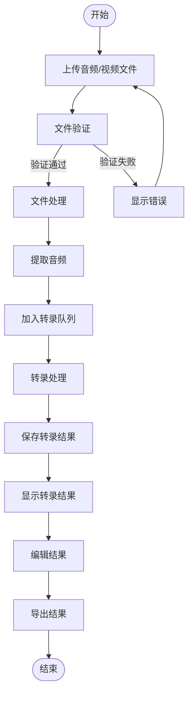

### 1.2 系统目标

- **高准确度**: 利用先进的AI模型提供>95%的转录准确率
- **快速处理**: 处理速度至少是音频长度的1/3
- **优秀体验**: 提供直观的用户界面和流畅的操作体验
- **安全可靠**: 保障用户数据安全和系统稳定性

## 2. 技术栈

### 2.1 前端技术栈
- **框架**: Next.js 14 (React)
  - 选型原因: 支持SSR/SSG，改善SEO和首屏加载性能
  - 版本选择: 14.x 支持React Server Components和App Router
- **语言**: TypeScript 5.x
  - 选型原因: 提供类型安全，减少运行时错误
- **UI组件**: 
  - Shadcn/UI: 基于Radix UI的高度可定制组件库
  - Radix UI: 提供无障碍、无样式的基础组件
- **样式**: 
  - Tailwind CSS 3.x: 原子化CSS，提高开发效率
- **状态管理**: 
  - React Query 5.x: 处理服务器状态
  - Zustand/Jotai(可选): 全局客户端状态
- **表单处理**: 
  - React Hook Form 7.x: 高性能表单处理
  - Zod: 强类型表单验证
- **HTTP客户端**: 
  - Axios 1.x: 处理HTTP请求，拦截器支持
- **文件处理**: 
  - React Dropzone: 文件上传组件
  - Browser FileReader API: 客户端文件处理

### 2.2 后端技术栈
- **运行时**: Node.js 20.x (LTS)
  - 选型原因: 非阻塞I/O适合文件处理和异步操作
- **框架**: Express.js 4.x
  - 选型原因: 轻量级、灵活性高、生态系统成熟
- **语言**: TypeScript 5.x
  - 选型原因: 类型安全，与前端共享类型定义
- **文件处理**: 
  - Multer 1.x: 处理multipart/form-data文件上传
  - Sharp: 图像处理（如有需要）
- **音视频处理**: 
  - FFmpeg: 音视频转换和处理
  - @ffmpeg/ffmpeg: WebAssembly版FFmpeg
- **转录服务**: 
  - OpenAI Whisper API: 高精度音频转录，支持多国语言
  - 备选: Azure Speech Services, Google Speech-to-Text
- **自然语言处理**:
  - 语气标点分析: 使用Whisper API的高级功能
  - 语言检测: 自动识别并处理超过100种语言
  - 标点智能补全: 根据语气和语境添加标点
- **日志**: 
  - Winston: 结构化日志
  - Morgan: HTTP请求日志
- **API文档**: 
  - Swagger/OpenAPI: API自动文档
  - Joi/Zod: 请求验证

## 3. 系统架构

### 3.1 整体架构

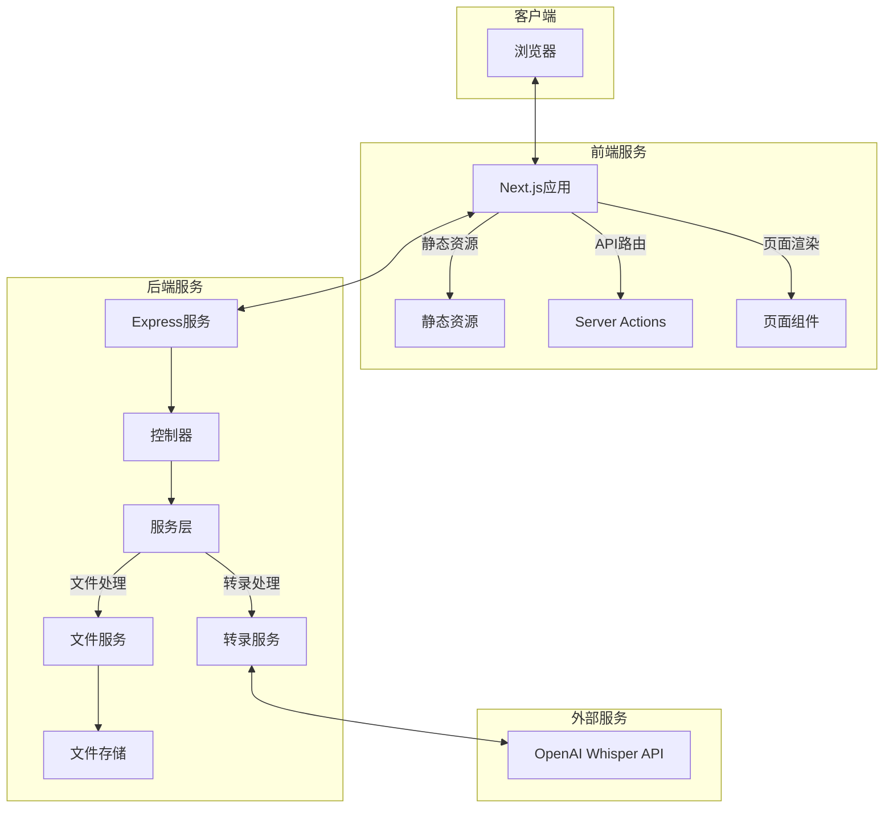

### 3.2 前端架构详解

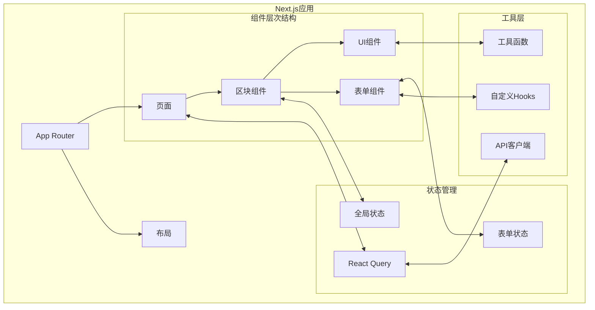

- **页面路由**: Next.js App Router
  - 基于文件系统的路由
  - 自动代码分割
  - 平行路由和拦截路由
- **组件架构**: 原子设计模式
  - 原子 (Atoms): 基础UI组件
  - 分子 (Molecules): 组合多个原子的功能组件
  - 有机体 (Organisms): 完整的功能区块
  - 模板 (Templates): 页面布局
  - 页面 (Pages): 完整页面
- **状态管理**: 
  - React Query: 服务器状态 (数据获取，缓存，同步)
  - Context API: 跨组件共享状态
  - useState/useReducer: 局部状态
- **性能优化**: 
  - 静态生成 (SSG): 预渲染静态页面
  - 增量静态再生成 (ISR): 定期刷新静态内容
  - 组件代码分割: 按需加载
  - 图片优化: Next.js 图像组件自动优化

### 3.3 后端架构详解

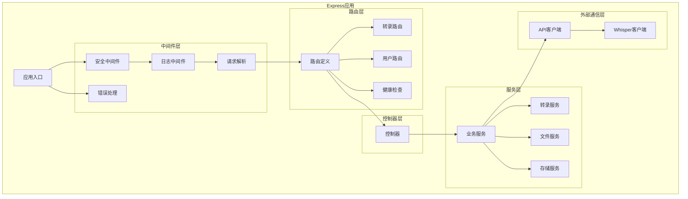

- **分层架构**:
  - 控制器层 (Controllers): 处理HTTP请求响应
    - 参数验证
    - 请求处理
    - 响应格式化
  - 服务层 (Services): 实现业务逻辑
    - 文件处理
    - 转录处理
    - 结果管理
  - 数据访问层: 处理数据存储和检索
    - 文件系统操作
    - 数据库操作 (可选)
- **中间件**:
  - 认证中间件: 验证用户身份和权限
  - 错误处理中间件: 统一处理并格式化错误
  - 文件上传中间件: 处理文件上传和验证
  - 请求验证中间件: 验证请求参数和格式

## 4. 核心功能模块详解

### 4.1 文件上传模块

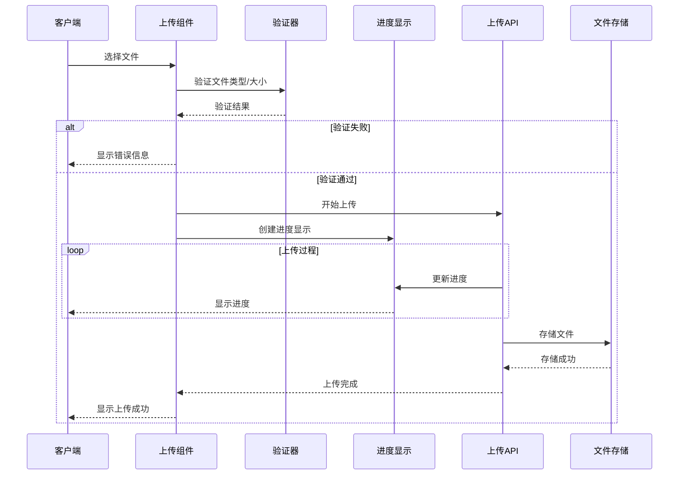

- **功能点详解**:
  - 支持拖拽上传: 使用React Dropzone
  - 文件类型验证: 支持.mp3, .wav, .mp4, .m4a, .webm等格式
  - 大小限制检查: 默认100MB上限，可配置
  - 上传进度显示: 实时进度条
  - 分片上传: 大文件自动分片处理
  - 断点续传: 网络中断后可恢复上传 (可选)

### 4.2 转录处理模块

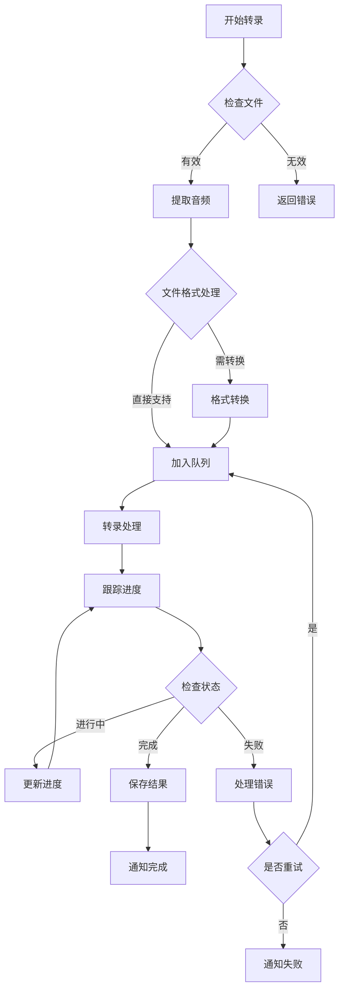

- **功能点详解**:
  - 音频/视频文件预处理:
    - 提取视频文件中的音频
    - 格式转换 (如需要)
    - 音频质量优化
  - 转录任务队列管理:
    - 基于优先级的队列系统
    - 任务分发与负载均衡
    - 任务状态追踪
  - 实时进度追踪:
    - 任务进度百分比计算
    - 预计完成时间计算
    - 状态更新通知
  - 结果缓存处理:
    - 自动保存转录结果
    - 临时存储管理
    - 过期数据清理策略

### 4.3 结果展示模块

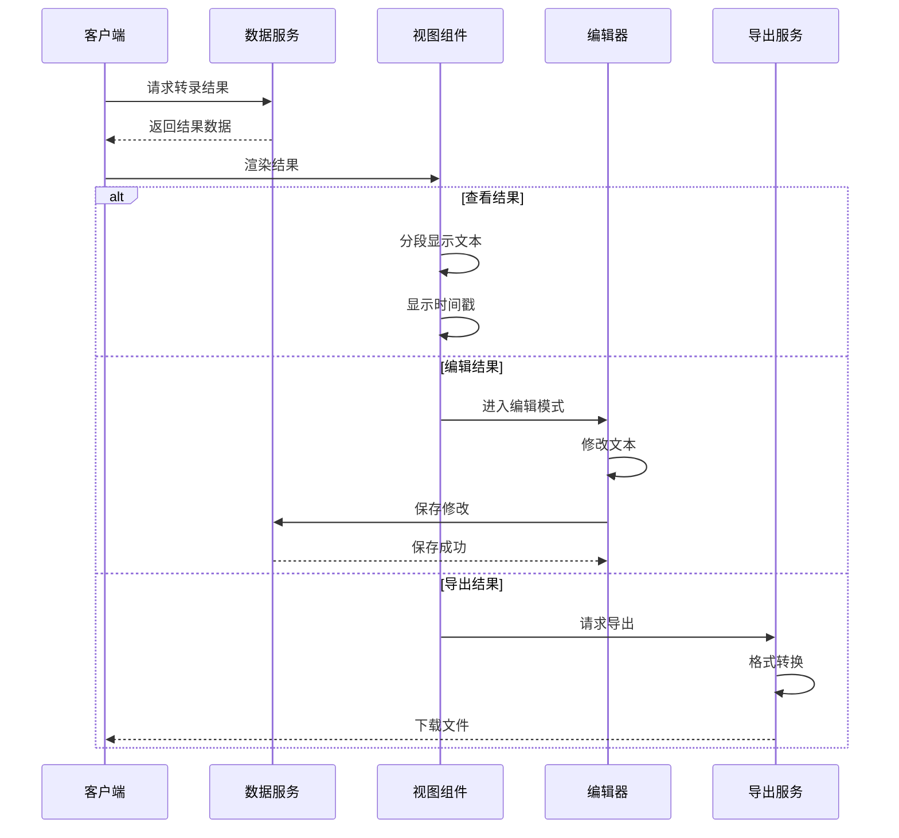

- **功能点详解**:
  - 分段文本显示:
    - 按时间戳分段
    - 支持折叠/展开
    - 高亮当前段落
  - 时间戳标记:
    - 精确到毫秒
    - 可点击跳转 (如有音频播放)
    - 自定义时间格式
  - 导出功能:
    - 纯文本格式 (.txt)
    - 字幕格式 (.srt, .vtt)
    - Word文档 (.docx)
    - JSON格式
  - 编辑功能:
    - 实时编辑
    - 拼写检查
    - 自动保存
    - 修订历史

### 4.4 多语言与标点智能处理模块

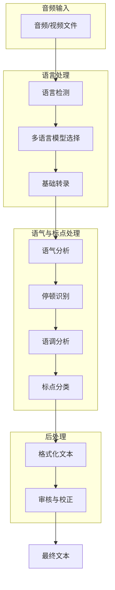

**多语言处理**:

- **语言自动检测**: 应用自动分析音频内容的语言，支持100+种语言和方言
- **多语言模型选择**: 基于检测到的语言，选择最佳的语言模型进行转录
- **混合语言处理**: 支持同一音频中出现多种语言的情况，可识别语言切换点
- **本地化处理**: 根据检测到的区域口音优化转录结果

**语气标点智能处理**:

- **语气分析**: 
  - 检测语调变化和情感表达
  - 识别疑问、感叹、陈述等语气
  - 分析语速和停顿模式
  
- **标点智能添加**:
  - 句号 (.)：识别陈述语气和完整句子的结束
  - 问号 (?)：基于上扬语调和疑问词识别
  - 感叹号 (!)：根据强调语气和音量突变添加
  - 逗号 (,)：分析自然停顿和语义分组
  - 引号 ("...")：检测引用语气和语调变化
  - 冒号、分号 (:;)：识别解释性内容和并列关系
  
- **标点优化**:
  - 自动调整标点密度，避免过度或不足
  - 根据不同语言的标点习惯进行调整
  - 支持标点偏好设置，满足不同用户需求

**技术实现**:

1. 利用 OpenAI Whisper 的高级功能实现多语言转录
2. 结合自定义的语音分析模块增强标点智能处理
3. 应用语音特征提取技术(MFCC, spectrogram)分析语气
4. 使用基于规则和AI的混合方法处理标点
5. 提供标点偏好设置，允许用户自定义标点风格

## 5. 详细数据流

### 5.1 文件上传流程

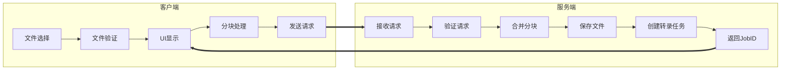

详细步骤:
1. **客户端文件选择**:
   - 通过文件对话框或拖放区选择文件
   - 获取文件元数据 (大小、类型、名称)
   
2. **客户端文件验证**:
   - 检查文件类型是否支持
   - 检查文件大小是否在限制范围内
   - 检查文件是否损坏 (基本检查)

3. **客户端分块处理** (大文件):
   - 将文件分割为固定大小的块 (如2MB)
   - 计算每块的哈希值用于校验
   - 准备分块上传

4. **服务端接收与验证**:
   - 接收文件或文件块
   - 验证用户权限和请求合法性
   - 检查服务器存储空间

5. **服务端文件处理**:
   - 合并文件块 (如适用)
   - 存储到临时位置
   - 病毒扫描 (可选)
   - 文件元数据提取

6. **任务创建**:
   - 生成唯一的jobId
   - 创建转录任务记录
   - 将任务添加到队列
   - 返回jobId给客户端

### 5.2 转录流程

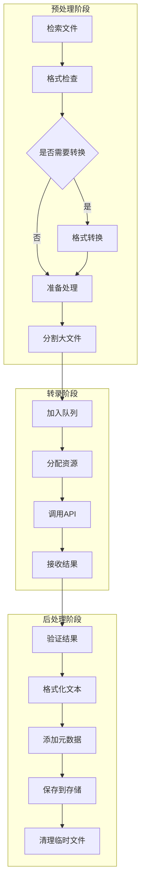

详细步骤:
1. **预处理阶段**:
   - 从存储中检索目标文件
   - 识别文件格式和编码
   - 如果是视频，提取音频轨道
   - 如果需要，转换为转录服务支持的格式
   - 对于长音频，可能分割为小段

2. **转录阶段**:
   - 将处理后的音频文件加入转录队列
   - 按优先级和资源可用性分配处理资源
   - 调用转录API (发送音频数据)
   - 接收API返回的转录结果
   - 处理可能的API错误和重试逻辑

3. **后处理阶段**:
   - 验证转录结果的完整性
   - 格式化转录文本 (断句、标点等)
   - 添加元数据 (时间戳、置信度等)
   - 将结果保存到持久化存储
   - 更新任务状态为"完成"
   - 清理临时文件和处理资源

## 6. 详细的类图和组件关系

### 6.1 后端核心类图
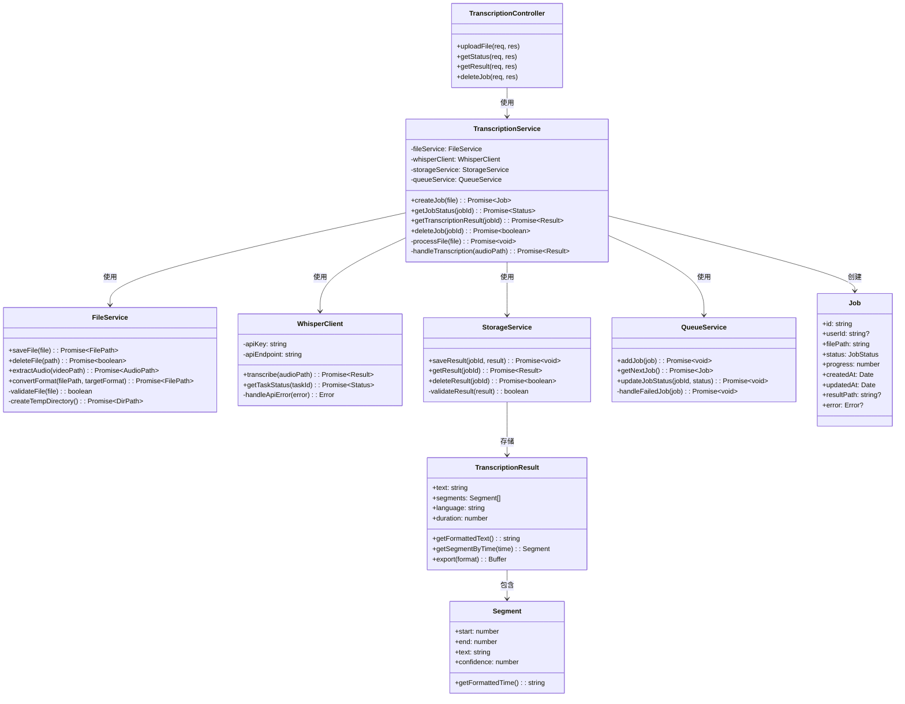

### 6.2 前端组件层次图
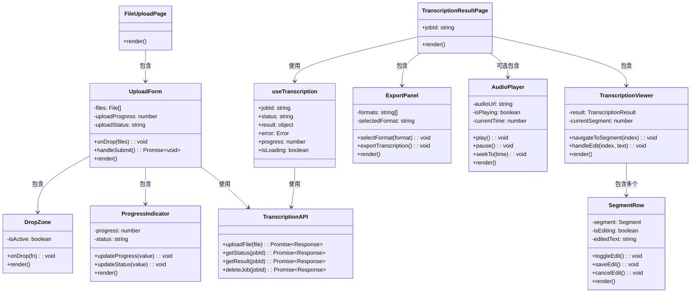

## 7. 部署架构详解

### 7.1 开发环境部署

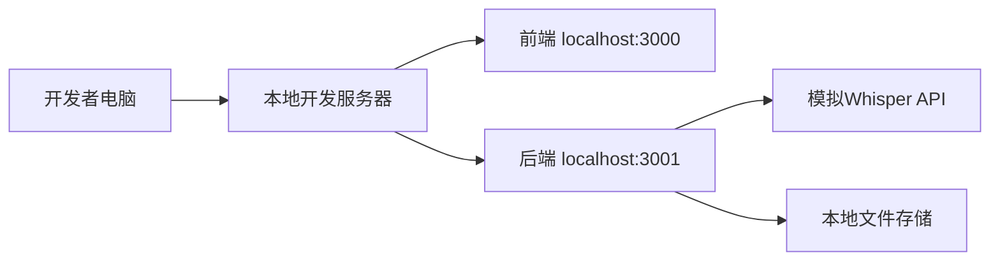

### 7.2 生产环境部署

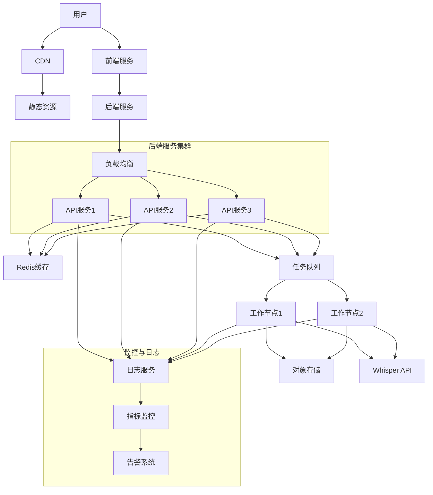

## 8. 扩展性与技术选择详解

### 8.1 技术选择理由

| 技术 | 选择理由 | 备选方案 |
|------|----------|----------|
| Next.js | 同构渲染、开发体验、SEO优化 | Remix, Gatsby |
| TypeScript | 类型安全、智能提示、维护性 | JavaScript + JSDoc |
| Express | 轻量级、灵活性、生态系统 | Fastify, NestJS |
| React Query | 服务器状态管理、缓存机制 | SWR, Apollo Client |
| Shadcn/UI | 可定制性、体验一致性 | MUI, Chakra UI |
| Whisper API | 高准确度、多语言支持 | Google Speech-to-Text, Azure |

### 8.2 水平扩展策略

- **无状态服务设计**:
  - 所有服务实例无状态，可随时启动或停止
  - 使用共享缓存存储会话状态
  - 使用分布式锁防止并发问题

- **分布式文件存储**:
  - 使用对象存储 (如S3兼容服务) 存储文件
  - 实现CDN加速文件分发
  - 考虑冷热存储分离策略

- **缓存层设计**:
  - 多级缓存策略
  - 转录结果缓存
  - 常用请求的响应缓存
  - 用户会话缓存

### 8.3 功能扩展计划

- **短期计划** (1-3个月):
  - 多语言支持
  - 高级文本编辑功能
  - 导出格式扩展
  - 基本用户认证

- **中期计划** (3-6个月):
  - 用户协作功能
  - 订阅模式
  - 字幕生成与编辑
  - 批量处理功能

- **长期计划** (6-12个月):
  - API接口开放
  - 插件系统
  - 第三方集成
  - 企业级功能