# 前后端交互文档

## 1. 交互流程

### 1.1 文件上传和转录流程

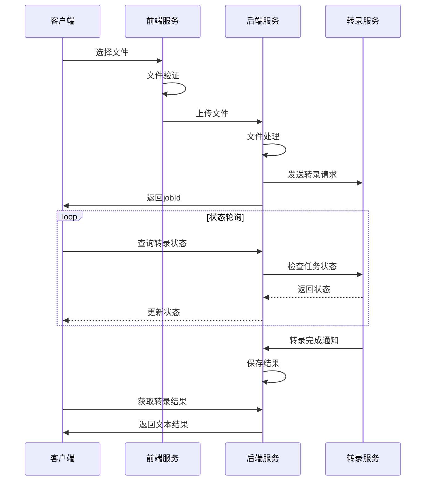

### 1.2 状态管理流程

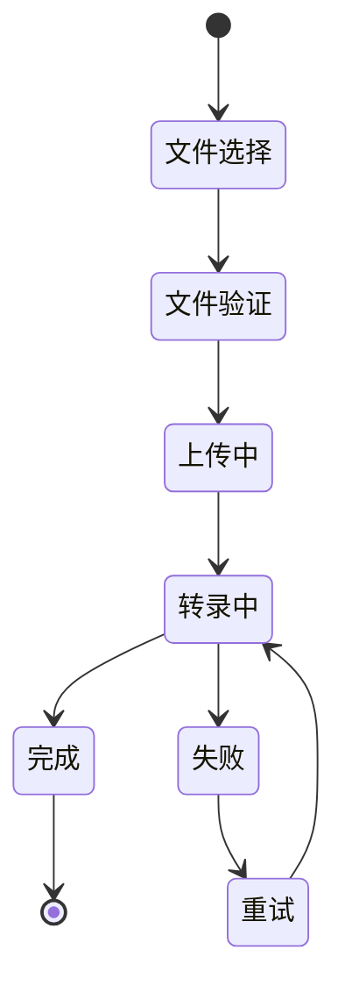

## 2. 数据交互格式

### 2.1 文件上传请求

**前端代码示例:**
```typescript
const uploadFile = async (file: File, options = {}) => {
  const formData = new FormData();
  formData.append('file', file);
  
  // 添加多语言和语气标点选项
  if (options.language) {
    formData.append('language', options.language);
  }
  
  // 多语言识别选项
  formData.append('detect_language', options.detectLanguage ?? true);
  formData.append('multi_language', options.multiLanguage ?? true);
  
  // 语气标点选项
  formData.append('auto_punctuation', options.autoPunctuation ?? true);
  formData.append('punctuation_style', options.punctuationStyle ?? 'standard');
  formData.append('tone_analysis', options.toneAnalysis ?? true);
  
  try {
    const response = await axios.post('/api/transcription/upload', formData, {
      headers: {
        'Content-Type': 'multipart/form-data',
      },
      onUploadProgress: (progressEvent) => {
        const progress = Math.round(
          (progressEvent.loaded * 100) / progressEvent.total
        );
        updateProgress(progress);
      },
    });
    return response.data;
  } catch (error) {
    handleError(error);
  }
};
```

**后端处理示例:**
```typescript
const handleFileUpload = async (req: Request, res: Response) => {
  try {
    const file = req.file;
    const options = {
      language: req.body.language,
      detectLanguage: req.body.detect_language === 'true',
      multiLanguage: req.body.multi_language === 'true',
      autoPunctuation: req.body.auto_punctuation === 'true',
      punctuationStyle: req.body.punctuation_style || 'standard',
      toneAnalysis: req.body.tone_analysis === 'true'
    };
    
    const jobId = await transcriptionService.createJob(file, options);
    res.json({
      success: true,
      data: {
        jobId,
        status: 'waiting',
      },
    });
  } catch (error) {
    handleError(error, res);
  }
};
```

## 3. 状态管理

### 3.1 前端状态管理

```typescript
// 使用 React Query 管理状态
const useTranscriptionStatus = (jobId: string) => {
  return useQuery({
    queryKey: ['transcription', jobId],
    queryFn: () => fetchTranscriptionStatus(jobId),
    enabled: !!jobId,
    refetchInterval: (data) => {
      if (data?.status === 'completed' || data?.status === 'failed') {
        return false;
      }
      return 3000; // 每3秒轮询一次
    },
  });
};
```

### 3.2 后端状态更新

```typescript
const updateTranscriptionStatus = async (
  jobId: string,
  status: TranscriptionStatus,
  progress?: number
) => {
  try {
    await TranscriptionModel.update(jobId, {
      status,
      progress,
      updatedAt: new Date(),
    });
  } catch (error) {
    logger.error('Failed to update transcription status', {
      jobId,
      status,
      error,
    });
  }
};
```

## 4. 错误处理

### 4.1 前端错误处理

```typescript
const handleError = (error: any) => {
  if (axios.isAxiosError(error)) {
    const errorMessage = error.response?.data?.error?.message 
      || '上传失败，请重试';
    
    toast.error(errorMessage);
    
    // 特定错误处理
    switch (error.response?.status) {
      case 413:
        handleFileTooLarge();
        break;
      case 415:
        handleInvalidFileType();
        break;
      default:
        handleGenericError();
    }
  }
};
```

### 4.2 后端错误处理

```typescript
const errorHandler = (
  error: Error,
  req: Request,
  res: Response,
  next: NextFunction
) => {
  logger.error('API Error:', error);

  if (error instanceof ValidationError) {
    return res.status(400).json({
      success: false,
      error: {
        code: 'VALIDATION_ERROR',
        message: error.message,
      },
    });
  }

  // 默认错误响应
  res.status(500).json({
    success: false,
    error: {
      code: 'INTERNAL_SERVER_ERROR',
      message: '服务器内部错误',
    },
  });
};
```

## 5. 安全考虑

### 5.1 文件上传安全

- 文件类型验证
- 文件大小限制
- 文件名清理
- 病毒扫描（可选）

### 5.2 API 安全

- CORS 配置
- 请求限制
- 认证授权
- 数据验证

## 6. 性能优化

### 6.1 前端优化

- 文件分片上传
- 状态缓存
- 懒加载组件
- 防抖/节流处理

### 6.2 后端优化

- 文件流处理
- 任务队列
- 结果缓存
- 并发控制

## 7. 组件交互图

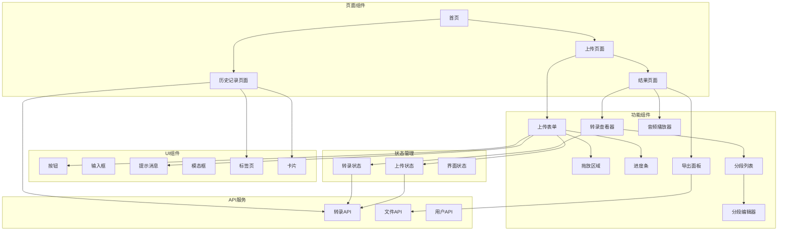

## 8. 详细组件结构

### 8.1 上传组件详细结构

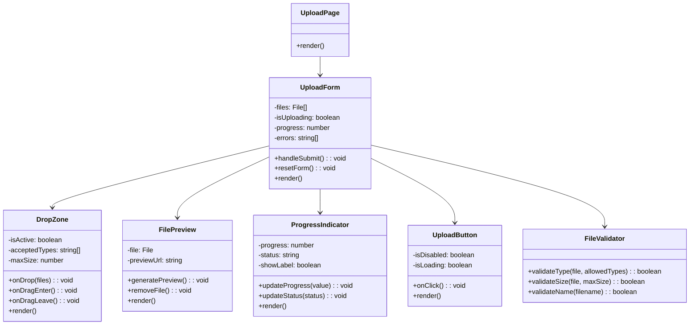

### 8.2 转录结果组件详细结构

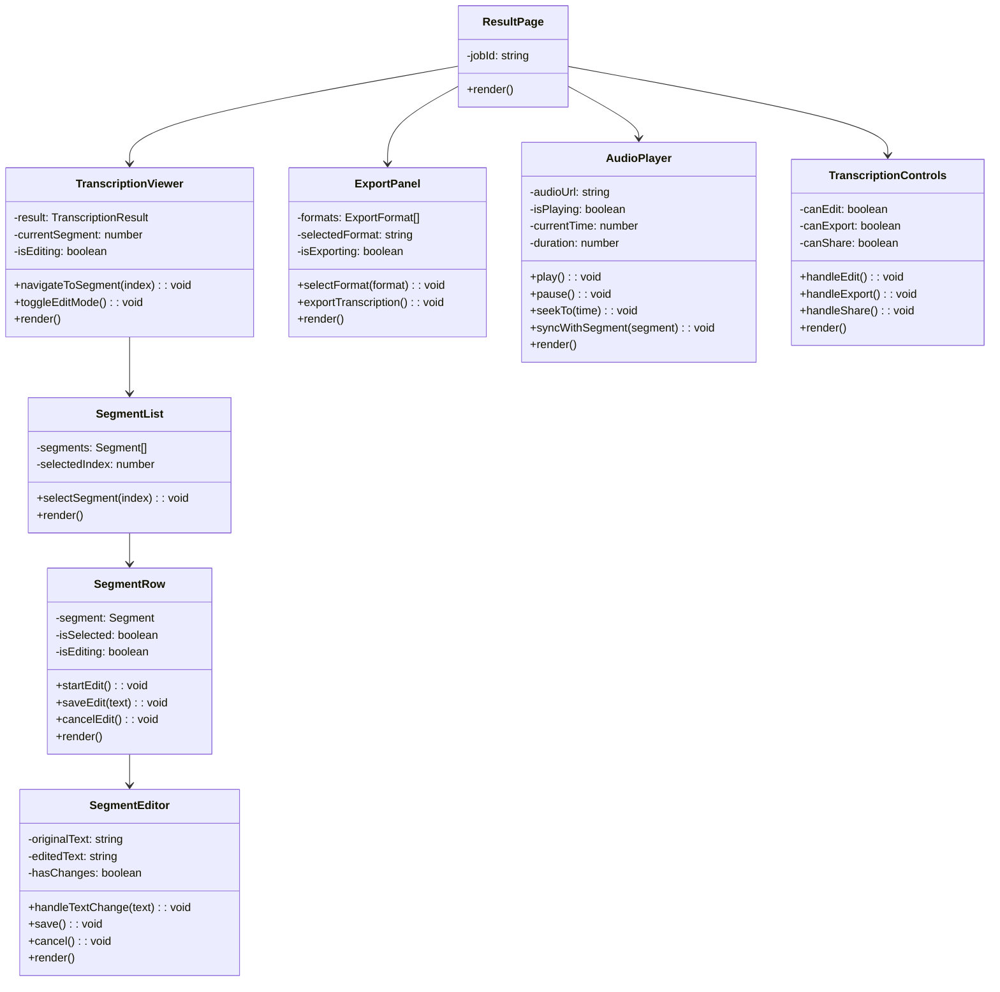

## 9. 前后端数据流详解

### 9.1 上传流程数据流

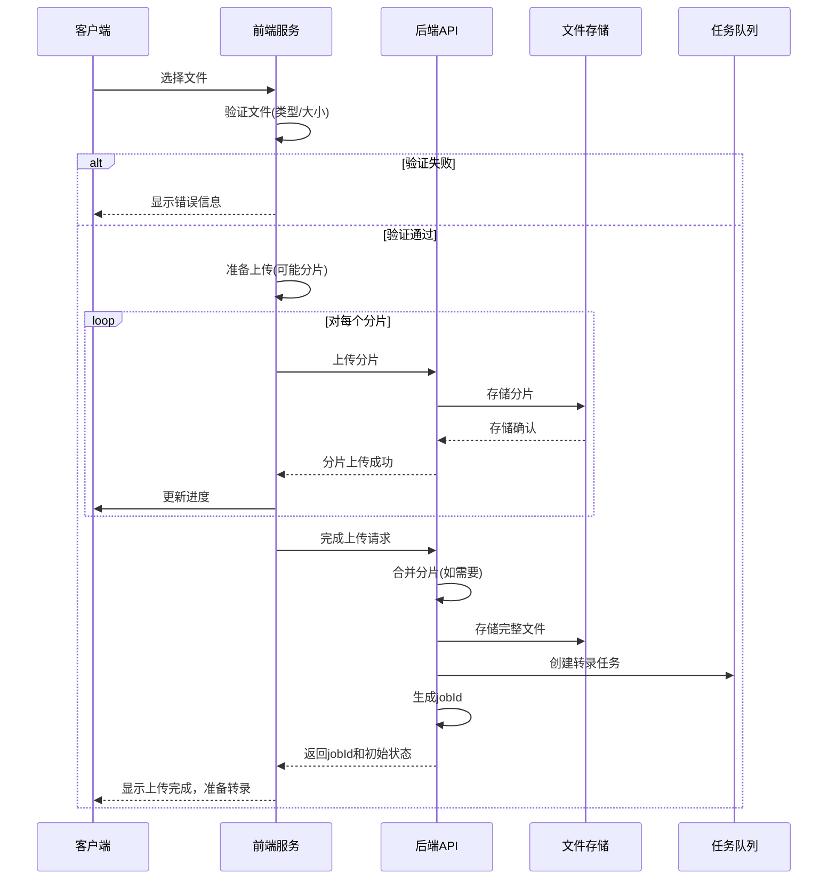

### 9.2 状态轮询数据流

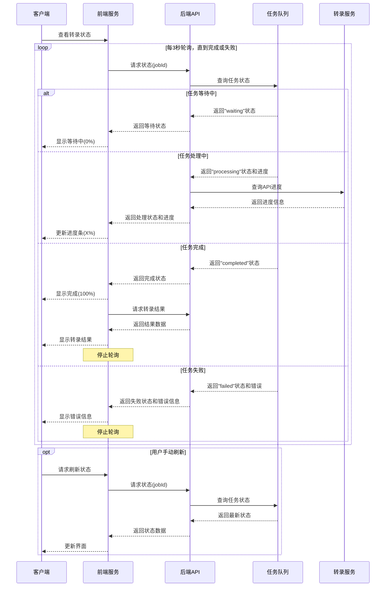

### 9.3 结果处理数据流

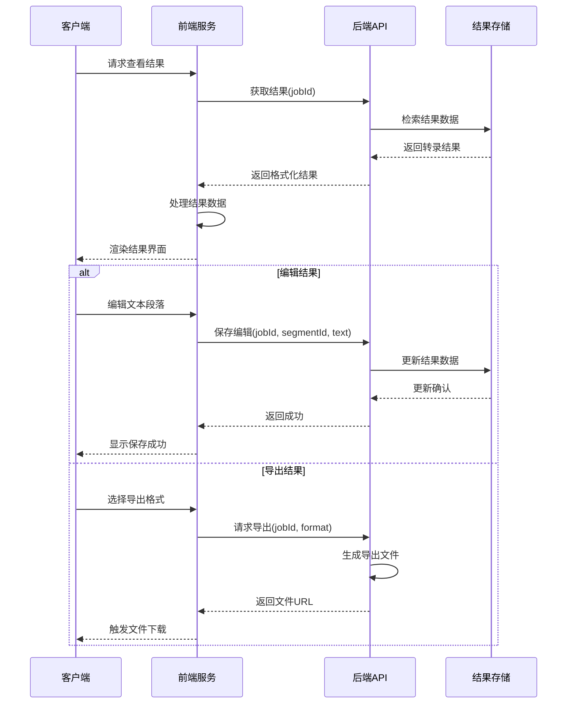

## 10. 多语言与语气标点处理流程

### 10.1 多语言识别流程

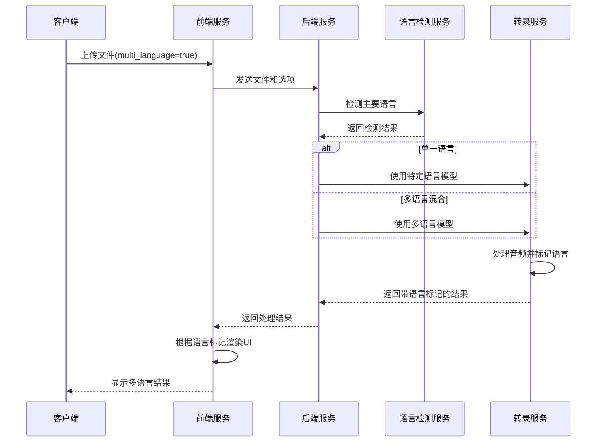

### 10.2 语气标点处理流程

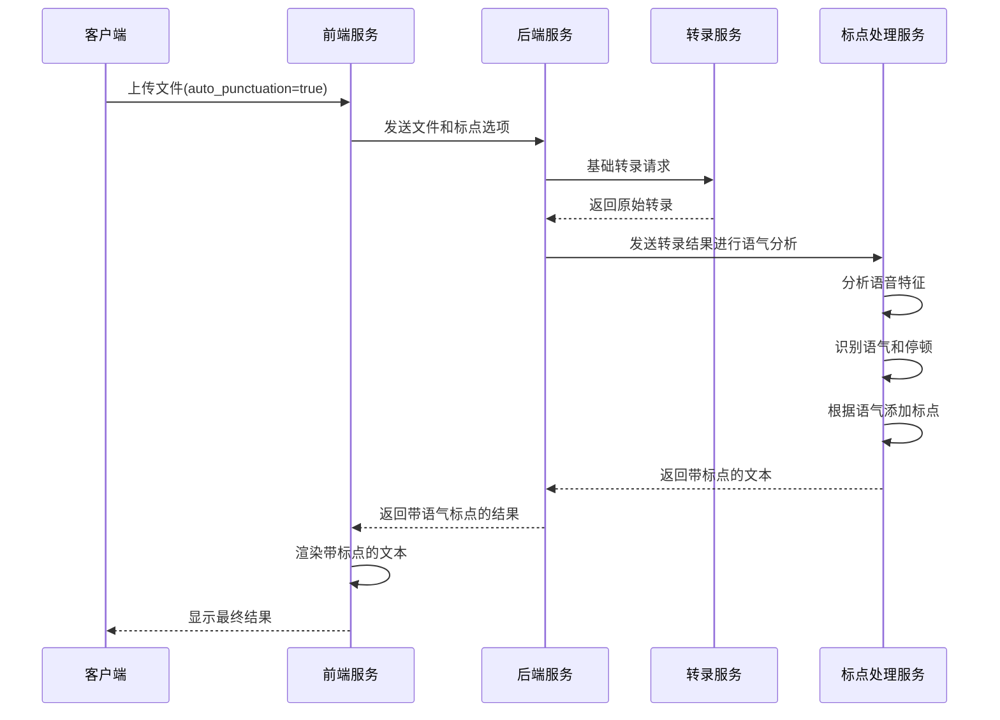

### 10.3 前端语气标点设置组件

**设置组件示例:**
```tsx
const TranscriptionSettings = ({ 
  settings, 
  onSettingsChange 
}: SettingsProps) => {
  return (
    <div className="settings-panel">
      <h3>转录设置</h3>
      
      <div className="setting-group">
        <h4>语言设置</h4>
        <div className="setting-item">
          <Switch
            id="detect-language"
            checked={settings.detectLanguage}
            onCheckedChange={(checked) => 
              onSettingsChange({...settings, detectLanguage: checked})
            }
          />
          <Label htmlFor="detect-language">自动检测语言</Label>
        </div>
        
        {!settings.detectLanguage && (
          <Select
            value={settings.language}
            onValueChange={(value) => 
              onSettingsChange({...settings, language: value})
            }
          >
            <SelectTrigger>
              <SelectValue placeholder="选择语言" />
            </SelectTrigger>
            <SelectContent>
              <SelectItem value="zh">中文</SelectItem>
              <SelectItem value="en">英语</SelectItem>
              <SelectItem value="ja">日语</SelectItem>
              {/* 更多语言选项 */}
            </SelectContent>
          </Select>
        )}
        
        <div className="setting-item">
          <Switch
            id="multi-language"
            checked={settings.multiLanguage}
            onCheckedChange={(checked) => 
              onSettingsChange({...settings, multiLanguage: checked})
            }
          />
          <Label htmlFor="multi-language">支持混合多语言</Label>
        </div>
      </div>
      
      <div className="setting-group">
        <h4>标点和语气设置</h4>
        <div className="setting-item">
          <Switch
            id="auto-punctuation"
            checked={settings.autoPunctuation}
            onCheckedChange={(checked) => 
              onSettingsChange({...settings, autoPunctuation: checked})
            }
          />
          <Label htmlFor="auto-punctuation">智能标点</Label>
        </div>
        
        {settings.autoPunctuation && (
          <>
            <div className="setting-item">
              <Label htmlFor="punctuation-style">标点风格</Label>
              <RadioGroup
                id="punctuation-style"
                value={settings.punctuationStyle}
                onValueChange={(value) => 
                  onSettingsChange({...settings, punctuationStyle: value})
                }
              >
                <div className="radio-item">
                  <RadioGroupItem value="minimal" id="minimal" />
                  <Label htmlFor="minimal">最小标点</Label>
                </div>
                <div className="radio-item">
                  <RadioGroupItem value="standard" id="standard" />
                  <Label htmlFor="standard">标准标点</Label>
                </div>
                <div className="radio-item">
                  <RadioGroupItem value="detailed" id="detailed" />
                  <Label htmlFor="detailed">详细标点</Label>
                </div>
              </RadioGroup>
            </div>
            
            <div className="setting-item">
              <Switch
                id="tone-analysis"
                checked={settings.toneAnalysis}
                onCheckedChange={(checked) => 
                  onSettingsChange({...settings, toneAnalysis: checked})
                }
              />
              <Label htmlFor="tone-analysis">语气分析</Label>
            </div>
          </>
        )}
      </div>
    </div>
  );
};
```

### 10.4 多语言结果显示组件

**多语言结果组件示例:**
```tsx
const MultiLanguageTranscription = ({ segments }) => {
  return (
    <div className="transcription-result">
      {segments.map((segment, index) => (
        <div 
          key={index} 
          className="segment"
          data-language={segment.language}
        >
          <div className="segment-header">
            <span className="timestamp">
              {formatTime(segment.start)} - {formatTime(segment.end)}
            </span>
            <span className="language-badge">
              {getLanguageName(segment.language)}
            </span>
            {segment.tone && (
              <span className={`tone-indicator tone-${segment.tone}`}>
                {getToneName(segment.tone)}
              </span>
            )}
          </div>
          <p className="segment-text">{segment.text}</p>
        </div>
      ))}
    </div>
  );
};

// 辅助函数
const getLanguageName = (code) => {
  const languages = {
    zh: '中文',
    en: '英语',
    ja: '日语',
    // 更多语言...
  };
  return languages[code] || code;
};

const getToneName = (tone) => {
  const tones = {
    neutral: '平述',
    question: '疑问',
    exclamation: '感叹',
    informative: '说明',
    uncertain: '不确定',
    emphatic: '强调'
  };
  return tones[tone] || tone;
};
```

## 11. 后端中间件流程

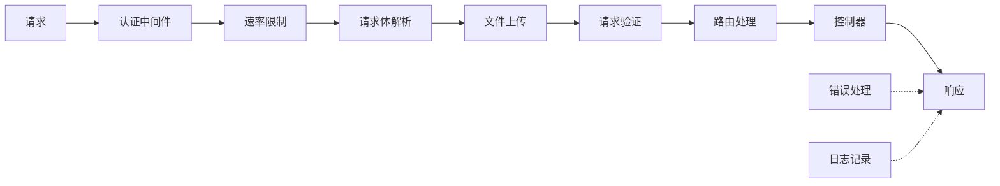

**代码示例:**
```typescript
// 应用中间件
const app = express();

// 基础中间件
app.use(helmet()); // 安全头
app.use(cors(corsOptions)); // CORS配置
app.use(morgan('combined')); // 请求日志
app.use(express.json()); // JSON解析
app.use(express.urlencoded({ extended: true })); // URL编码解析

// 认证中间件 (可选)
app.use('/api', authMiddleware);

// 速率限制
app.use('/api', rateLimit({
  windowMs: 15 * 60 * 1000, // 15分钟
  max: 100, // 每IP限制请求数
}));

// 文件上传中间件
app.use('/api/transcription/upload', upload.single('file'));

// 路由
app.use('/api/transcription', transcriptionRoutes);
app.use('/api/user', userRoutes);

// 错误处理中间件 (放在最后)
app.use(errorHandler);
```